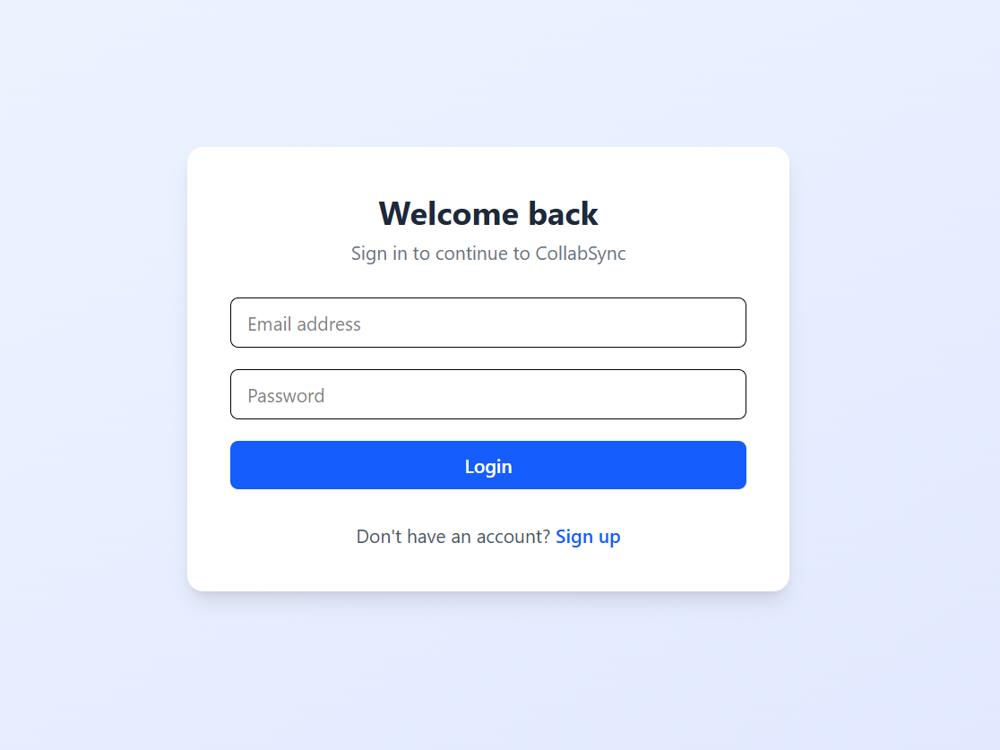
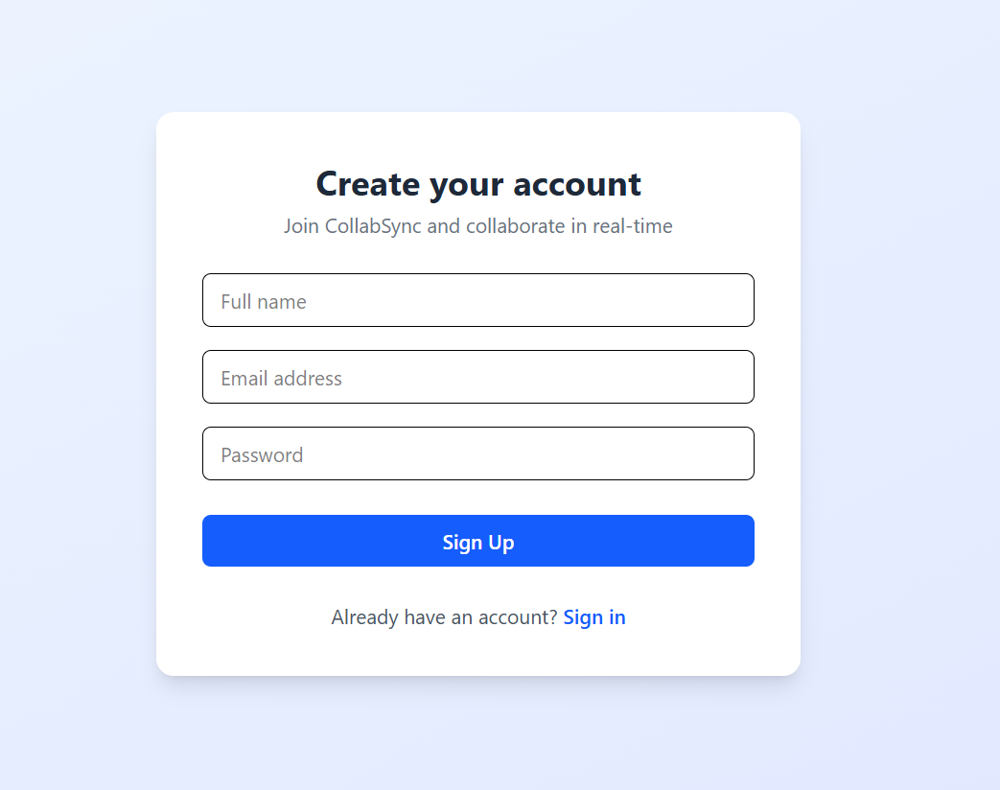
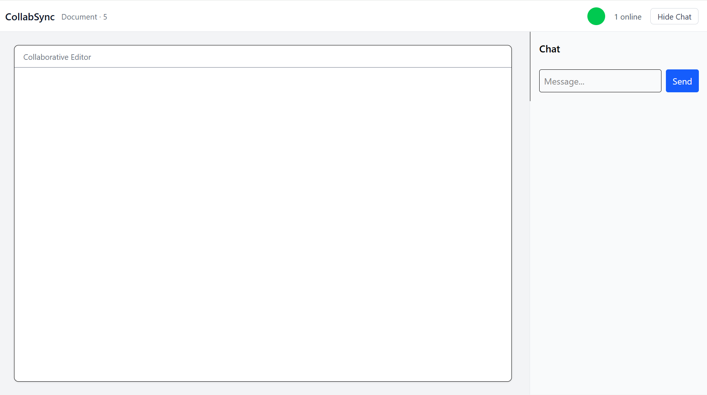
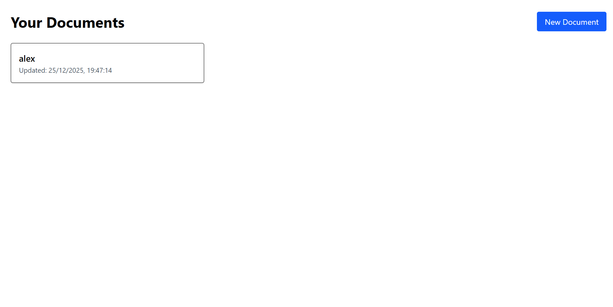
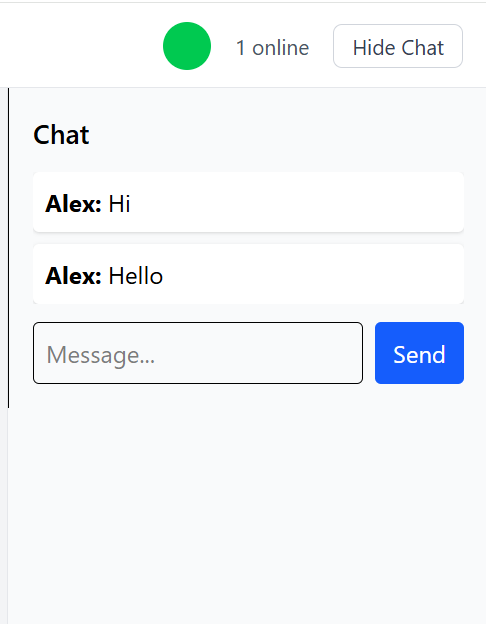

# CollabSync 🚀  
### Real-Time Collaborative Editor

CollabSync is a real-time collaborative document editor inspired by tools like Google Docs.  
It enables multiple users to edit the same document simultaneously with live cursors, presence indicators, and chat.

---

## ✨ Features

- 🔄 **Real-time collaboration** using WebSockets  
- 👥 **Live presence** with user avatars  
- 🖱️ **Live cursors** with user names  
- 💬 **Integrated chat panel**  
- 🔐 **Authentication** (signup/login)  
- ⚡ **Low-latency updates**  
- 🎨 Clean, modern UI (Tailwind CSS)

---

## 📸 Screenshots

### 🔐 Authentication



### 📝 Editor


### Dashboard


### 💬 Chat


---

## 🛠️ Tech Stack

**Frontend**
- React
- Tailwind CSS
- WebSockets

**Backend**
- Node.js
- Express
- WebSocket Gateway

**Other**
- JWT Authentication
- REST APIs
- Deployed on Vercel / Railway

---

## 🧠 Architecture Overview

```text
Client (React)
|
| WebSocket (real-time events)
|
WebSocket Server
|
| REST API
|
Backend (Node + Express)
```

- WebSockets handle live edits, cursors, presence, and chat
- REST APIs handle authentication and document loading
- Frontend renders collaborative UI overlays

---

## 🚀 Getting Started (Local Setup)

```bash
# Clone repository
git clone <repo-url>

# Install frontend dependencies
cd frontend
npm install
npm run dev

# Install backend dependencies
cd backend
npm install
npm run dev
```
## Project Structure

```text
CollabSync/
│
├── frontend/                     # React frontend (Vite + Tailwind)
│   ├── src/
│   │   ├── components/           # Reusable UI components
│   │   │   ├── EditorSurface.jsx
│   │   │   ├── ChatPanel.jsx
│   │   │   └── ...
│   │   │
│   │   ├── pages/                # Route-level pages
│   │   │   ├── Login.jsx
│   │   │   ├── Signup.jsx
│   │   │   ├── Editor.jsx
│   │   │   └── Dashboard.jsx
│   │   │
│   │   ├── context/              # Global state management
│   │   │   └── AuthContext.jsx
│   │   │
│   │   ├── websocket/            # WebSocket client & API helpers
│   │   │   ├── client.js
│   │   │   └── api.js
│   │   │
│   │   ├── router.jsx            # App routing
│   │   ├── main.jsx              # App entry point
│   │   └── index.css             # Tailwind CSS entry
│   │
│   ├── vite.config.js
│   ├── tailwind.config.js
│   └── index.html
│
├── gateway/                      # Backend + WebSocket gateway
│   ├── src/
│   │   ├── index.js              # Server entry point
│   │   ├── wsServer.js           # WebSocket server setup
│   │   ├── roomManager.js        # Manages document rooms & users
│   │   ├── db.js                 # Database connection
│   │   │
│   │   ├── controllers/          # Business logic
│   │   │   ├── auth.controller.js
│   │   │   └── document.controller.js
│   │   │
│   │   ├── routes/               # REST API routes
│   │   │   ├── auth.routes.js
│   │   │   └── document.routes.js
│   │   │
│   │   ├── events/               # WebSocket event handlers
│   │   │   ├── editor.events.js
│   │   │   ├── presence.events.js
│   │   │   ├── chat.events.js
│   │   │   └── index.js
│   │   │
│   │   ├── middleware/           # Auth & WS middleware
│   │   │   ├── auth.js
│   │   │   └── wsAuth.js
│   │   │
│   │   ├── models/               # Database models
│   │   │   ├── user.model.js
│   │   │   ├── document.model.js
│   │   │   ├── collab.model.js
│   │   │   └── version.model.js
│   │   │
│   │   ├── ot/                   # Operational Transform logic
│   │   │   ├── apply.js
│   │   │   ├── operations.js
│   │   │   └── transform.js
│   │   │
│   │   ├── redis/                # Redis pub/sub for scaling
│   │   │   ├── pub.js
│   │   │   ├── sub.js
│   │   │   └── handleRedisEvent.js
│   │   │
│   │   └── utils/                # Utility helpers
│   │       ├── jwt.js
│   │       └── uuid.js
│
├── database/                     # Database-related configs (if any)
│
├── screenshots/                  # Screenshots for README
│   ├── login.png
│   ├── signup.png
│   ├── dashboard.png
│   ├── editor-light.png
│   └── chat.png
│
├── docker-compose.yml            # Local dev orchestration
├── README.md                     # Project documentation
├── .gitignore
└── package-lock.json
```

🎯 Why this project?

This project was built to understand:

Real-time systems

Multi-user synchronization

Collaborative UX design

Full-stack application architecture

It focuses on engineering concepts, not just UI.

📌 Future Improvements

Operational Transform (OT) for conflict resolution

Document version history

Role-based permissions

Dark mode (optional)

Performance optimizations for large documents

👤 Author

Manish
Aspiring Software Engineer | Full-Stack Developer